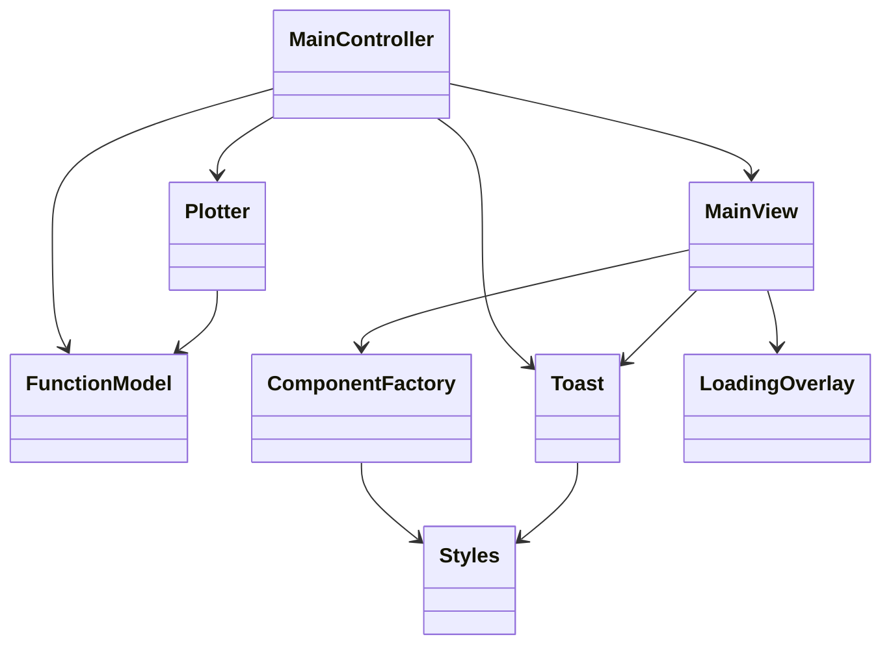
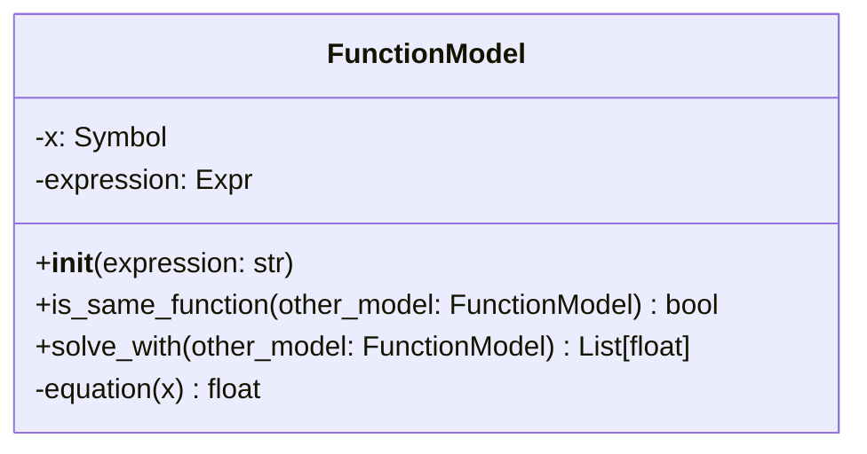
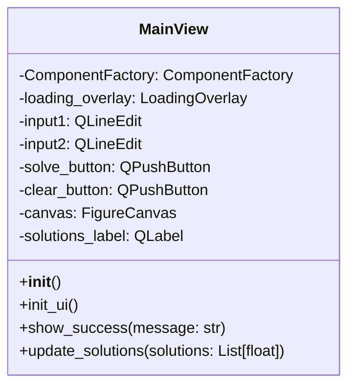
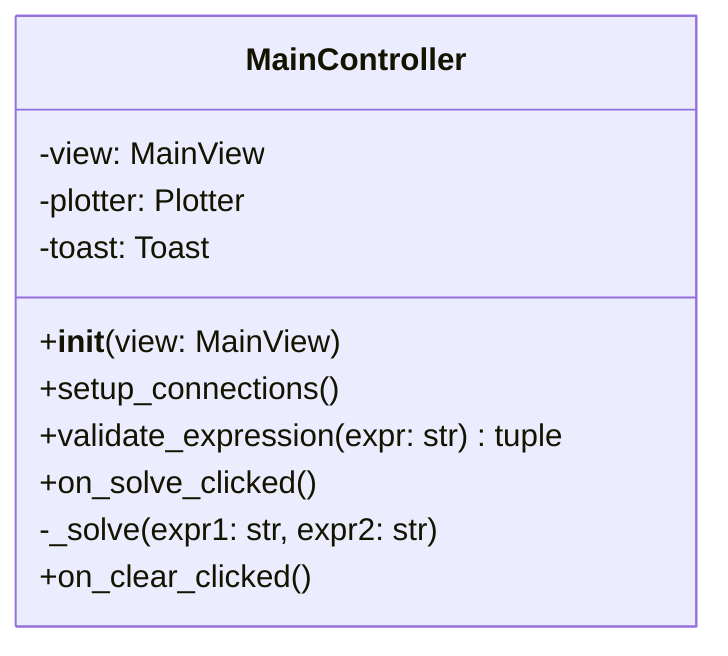
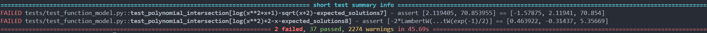
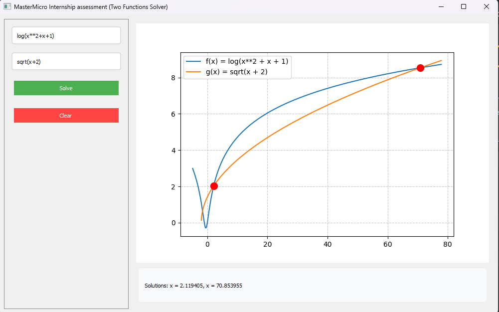
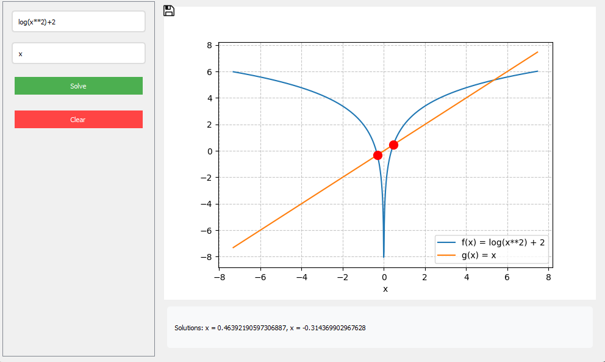

# Function Intersection Solver

A Python application that finds and visualizes intersection points between two mathematical functions using both symbolic and numerical methods.

## 1. Demo

<a href="https://drive.google.com/file/d/1WylGyMgI6jv2DWOwOPiK7qoqgA9NBWXa/view?usp=sharing">Check out the demo here</a>

## 2. Prerequisites

- Python 3.10
- Required packages:

```bash
pip install pyside2 numpy sympy matplotlib pytest
```

## 3. How to run

1. Clone the repository:

```bash
git clone https://github.com/yourusername/function-solver.git
cd function-solver
```

2. Run the application

```bash
python main.py
```

## 4. Architecture overview



- Model-View-Controller (MVC) pattern implementation
- Separate modules for mathematical operations, UI, and control logic
- Utility classes for plotting, styling and notifications

### 4.1 Model (`FunctionModel`)

- Handles mathematical expressions
- Provides symbolic and numerical solving
- Manages function domains and intersection points



### 4.2 View (`MainView`)

Main application window with:

- Function input fields
- Plot area
- Solution display
- Loading overlay
- Toast notifications



### 4.3 Controller(`MainController`)

- Manages interaction between View and Model
- Handles input validation
- Error handling
- Plot updates
- Solution display



### 4.4 Utilities

`Plotter`, `Toast`, `Styles` and `ComponentFactory` classes were used to
maintain clean, modularized code.

## 5. Input validation

- Only variable 'x' allowed
- Only 'log' and 'sqrt' functions permitted
- Explicit multiplication required (e.g., '3\*x' not '3x')
- Balanced parentheses
- Valid mathematical expressions


### Examples:

###### Valid expressions

```markdown
f(x) = 2*x + 1
g(x) = log(x^2)
f(x) = sqrt(x + 2*x + 3)
f(x) = log(sqrt(x))
```

###### Invalid expressions

```markdown
2x + 1 # Missing multiplication operator
sin(x) # Unsupported function
y + x # Invalid variable
log(x # Unbalanced parentheses
```

## 6. Solution approaches

### 6.1 Symbolic Solution

- Primary solution method
- Uses SymPy's solve() function
- Provides exact solutions
- Best for polynomial equations


### 6.2 Numerical Solution

- Fallback method when symbolic fails
- Implements Newton-Raphson method
- Uses adaptive range sampling
- Domain-aware solution search
- Handles transcendental functions


## 7. Test cases

Run the tests:

```bash
pytest tests/
```

Test coverage includes:

- Function model tests: Mathematical operations
- Controller tests: Input validation
- View tests: UI components
- Integration tests: End-to-end functionality

After running all 39 test cases of which 37 succeeded as shown (warnings can be suppressed they only appear due to numerical solutions trying different values which may not be applicable to the function):


### Examples:

#### Polynomial Intersection Test

```python
@pytest.mark.parametrize("fx_expr,gx_expr,expected_solutions", [
    ("x^2", "x", [0, 1])              # Quadratic intersecting with linear
])
def test_polynomial_intersection(fx_expr, gx_expr, expected_solutions):
    fx = FunctionModel(fx_expr)
    gx = FunctionModel(gx_expr)
    solutions = fx.solve_with(gx)
    assert solutions == expected_solutions
```

```bash
$ pytest tests/test_function_model.py::test_polynomial_intersection -v
============================================ test session starts =============================================
collected 1 item

tests/test_function_model.py::test_polynomial_intersection[x^2-x-[0, 1]] PASSED              [100%]

============================================= 1 passed in 1.02s =============================================
```

#### Input validation test

```python
@pytest.mark.parametrize("expression,is_valid", [
    ("log(x^2) + 2*x", True),         # Valid expression
    ("2x + 1", False)                 # Invalid implicit multiplication
])
def test_expression_validation(controller, expression, is_valid):
    result, _ = controller.validate_expression(expression)
    assert result == is_valid
```

```bash
$ pytest tests/test_main_controller.py::test_expression_validation -v
============================================ test session starts =============================================
collected 2 items

tests/test_main_controller.py::test_expression_validation[log(x^2) + 2*x-True] PASSED        [ 50%]
tests/test_main_controller.py::test_expression_validation[2x + 1-False] PASSED               [100%]

============================================= 2 passed in 1.24s =============================================
```

### Failed test cases

There are still test cases which would fail due to the limitations of numerical method range selection.

#### Examples:

```python
@pytest.mark.parametrize("fx_expr,gx_expr,expected_solutions", [
    ("log(x**2+x+1)","sqrt(x+2)",[-1.57875,2.11941,70.854]),
    ("log(x**2)+2","x",[0.463922,-0.31437,5.35669])
])
def test_polynomial_intersection(fx_expr,gx_expr,expected_solutions):
    fx = FunctionModel(fx_expr)
    gx = FunctionModel(gx_expr)

    real_solutions = fx.solve_with(gx)
    assert real_solutions == expected_solutions
```

These two test cases failed because they couldn't find all solutions, as the selected range didn't explore the solutions as shown in the following two snippets:




Complex numerical methods are needed to correctly choose the range of x values to try the numerical solution. Although this is not an easy task and it needs much more time and effort to implement these methods correctly. Previously, `Newton-Raphson` method was used to guarantee quick convergence but was later discarded and replaced with `Adaptive range expansion`. Yet, this does not fix the problem as shown above in the two test cases, but it can pass most of the test cases as shown as well in the 37 test cases. Domain analysis methods or heuristic based methods would be a good solution as well.

## 8. Acknowledgments

- Test cases were mostly generated with the help of Claude 3.5 Sonnet
- Some of the styles were also generated with the help of Claude
- This is a MasterMicro's internship task, I do not own any of the logos used in the application, all rights reserved to <a href="https://www.linkedin.com/company/master-micro/?originalSubdomain=eg">MasterMicro</a>.

## 9. Thanks for your time! ❤️
